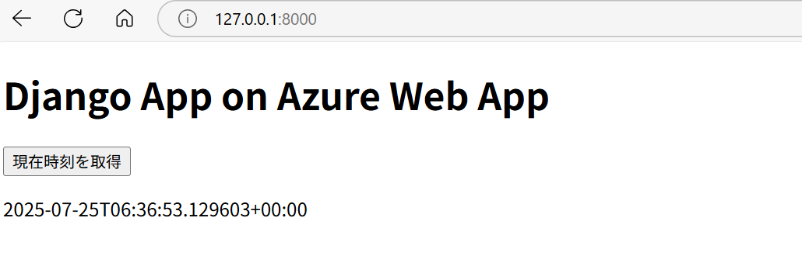

# django-test



## ローカルで動作させる場合
1. myproject/settings.pyの設定を変更
```python
DEBUG = True
ALLOWED_HOSTS = ["localhost", "127.0.0.1"]
```
2. マイグレーション
```bash
python manage.py migrate
```

3. サーバー起動
```bash
python manage.py runserver 0.0.0.0:8000
```
ブラウザで`http://127.0.0.1:8000`にアクセスする。

